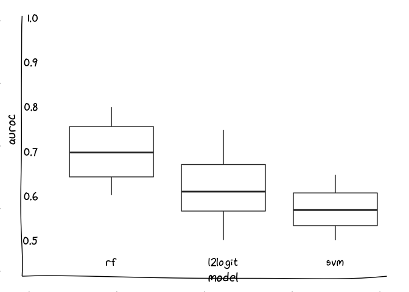

<!-- README.md is generated from README.Rmd. Please edit that file -->

# handmade-plots

<!-- badges: start -->

<!-- badges: end -->

``` r
library(extrafont)
library(cowplot)
library(tidyverse)
library(xkcd)
```

``` r
set.seed(2019)
axes <- data.frame(y = c(0, 1),
                   x = c(0, 1)) %>%
  ggplot(aes(x, y)) +
  geom_point(color = 'white') +
  theme_void() +
  xkcdaxis(range(0, 1), range(0.5, 1)) +
  theme(axis.ticks = element_blank())

plot <- data.frame(
  rf = runif(100, 0.6, 0.8),
  l2logit = runif(100, 0.5, 0.75),
  svm = runif(100, 0.45, 0.65)
) %>%
  pivot_longer(everything(), names_to = "model", values_to = 'auroc') %>%
  mutate(model = as_factor(model)) %>%
  ggplot(aes(model, auroc)) +
  geom_boxplot() +
  geom_hline(yintercept = 0.5, linetype = 'dashed') +
  ylim(0, 1) +
  theme_cowplot(font_family = 'xkcd Script', font_size = 16) +
  theme(axis.line = element_blank(),
        axis.ticks = element_blank())

aligned <- align_plots(axes, plot, align = 'hv', axis = 'lb')
ggdraw(aligned[[1]]) + draw_plot(aligned[[2]])
```

<!-- -->
