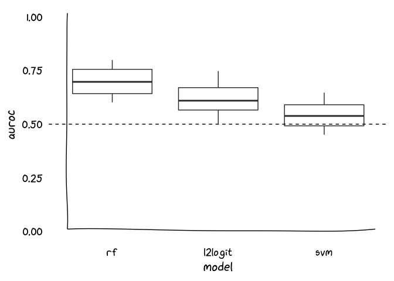

<!-- README.md is generated from README.Rmd. Please edit that file -->

# handmade-plots

<!-- badges: start -->

<!-- badges: end -->

``` r
library(extrafont)
#> Registering fonts with R
library(cowplot)
#> 
#> ********************************************************
#> Note: As of version 1.0.0, cowplot does not change the
#>   default ggplot2 theme anymore. To recover the previous
#>   behavior, execute:
#>   theme_set(theme_cowplot())
#> ********************************************************
library(tidyverse)
#> ── Attaching packages ─────────────────────────── tidyverse 1.3.0 ──
#> ✓ ggplot2 3.3.2     ✓ purrr   0.3.4
#> ✓ tibble  3.0.3     ✓ dplyr   1.0.0
#> ✓ tidyr   1.1.0     ✓ stringr 1.4.0
#> ✓ readr   1.3.1     ✓ forcats 0.5.0
#> ── Conflicts ────────────────────────────── tidyverse_conflicts() ──
#> x dplyr::filter() masks stats::filter()
#> x dplyr::lag()    masks stats::lag()
library(xkcd)
```

``` r
set.seed(2019)
axes <- data.frame(y = c(0, 1),
                   x = c(0, 1)) %>%
  ggplot(aes(x, y)) +
  geom_point(color = 'white') +
  theme_void() +
  xkcdaxis(range(0, 1), range(0, 1))
#> Warning in seq.default(0, 1, length = evaluation): partial argument match of
#> 'length' to 'length.out'

#> Warning in seq.default(0, 1, length = evaluation): partial argument match of
#> 'length' to 'length.out'

plot <- data.frame(
  rf = runif(100, 0.6, 0.8),
  l2logit = runif(100, 0.5, 0.75),
  svm = runif(100, 0.45, 0.65)
) %>%
  pivot_longer(everything(), names_to = "model", values_to = 'auroc') %>%
  mutate(model = as_factor(model)) %>%
  ggplot(aes(model, auroc)) +
  geom_boxplot() +
  ylim(0.5, 1) +
  theme_cowplot(font_family = 'xkcd Script', font_size = 16) +
  theme(line = element_blank())

aligned <- align_plots(axes, plot, axis = 'tr')
#> Warning: Removed 29 rows containing non-finite values (stat_boxplot).
ggdraw(aligned[[1]]) + draw_plot(aligned[[2]])
```

<!-- -->
